<h1 align="center">t3term</h1>

<p align="center">
  <strong>T3 Code without the window.</strong>
</p>

<p align="center">
  A terminal client in Rust. One 5.4 MB binary: the whole interface with no arguments,<br>
  a CLI you can script with a subcommand. Your threads are the ones the app already shows.
</p>

<p align="center">
  <a href="#try-it"><strong>Try it</strong></a> ·
  <a href="#why-it-exists"><strong>Why it exists</strong></a> ·
  <a href="#what-you-get"><strong>What you get</strong></a> ·
  <a href="#its-a-cli-too"><strong>CLI</strong></a> ·
  <a href="#how-it-works"><strong>How it works</strong></a>
</p>

<p align="center">
  
  
  
  
</p>

<p align="center">
  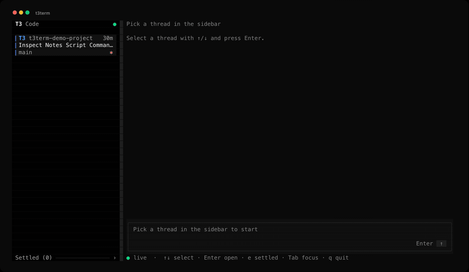
</p>

**New to T3 Code?** [It](https://github.com/pingdotgg/t3code) runs coding agents on your machine. Claude Code, Codex, Cursor, Grok and others, each working in its own thread on one of your projects, with approvals, permission modes and branches. It ships as an Electron desktop app, plus a web app and a phone app. t3term is the same thing as a terminal program. It connects to the T3 server you already run rather than starting one, so a thread you open here is the same thread the desktop app shows.

## Try it

There are no prebuilt binaries yet, so build it:

```bash
git clone https://github.com/krishhgg/t3term
cd t3term
cargo build --release

./target/release/t3term doctor   # does it see your server?
./target/release/t3term          # open the TUI
```

`cargo install --path .` puts `t3term` on your PATH instead.

You need T3 Code already running, either the desktop app or `t3` from [their installer](https://github.com/pingdotgg/t3code#installation), plus a Rust toolchain. t3term finds the server on its own and logs itself in, so there is nothing to configure. If `doctor` fails it names the step that failed. It cannot create a thread yet, so start one in the app and open it here.

Tested against T3 Code `0.0.46-nightly.20261007.2787` on orchestration protocol 2, on macOS. Linux and Windows have not been tried.

## Why it exists

**It's a TUI alternative to the desktop app.** Everything runs the same, you're just interacting through a terminal rather than a window.

**It's way lighter because it isn't a browser.** The desktop app is Electron, which means it ships Chromium, so a whole browser engine runs your window, with another process for the GPU and a few helpers around it, and one more every time you open a second window. That came out to about 1.1 GB in the run below. t3term is one Rust process drawing text cells, so it sits at 53 MB.

Both clients open on the same thread, on the same Mac, against one server holding 14 projects and 123 threads. Sampled every 5 seconds across a minute:

| | Memory | CPU |
| --- | --- | --- |
| T3 Code desktop windows (5 processes) | 1161 MB | 11.1% of one core |
| t3term (1 process) | 53 MB | 0.8% of one core |

Run `python3 benchmarks/compare_clients.py` with both clients open and it prints that table for your own machine. Memory is a sum of RSS, which overcounts pages the processes share, so read it as an upper bound.

Neither row counts what runs whichever client you use: T3's server itself used 449 MB, and the agents it had spawned used 2774 MB across 63 to 66 processes. The agents are the expensive part, and nothing here changes that. t3term replaces the window, not the engine.

Rust is a big part of why it stays that low, since there's no runtime or garbage collector underneath it and the whole binary is 5.4 MB. It only redraws when something actually changed, and never more than 30 times a second, so leaving a thread open costs you almost nothing. Long threads stay cheap too, because it only draws the lines that are on your screen instead of the whole history, which in the benchmark was around 12 times faster at 50,000 lines.

**It's scriptable.** Every subcommand takes `--json`, and `t3term threads --limit 1` answers in 30 to 50 ms using the saved login. Send a prompt from a git hook, wait for the turn, approve what it asks, read the result. One gap: when the agent asks a question rather than for approval, `requests` lists it but only the TUI can answer it.

**It's a client, not a fork.** t3term opens no database and starts no server. A thread you open here is the thread the desktop app and the phone app show.

<p align="center">
  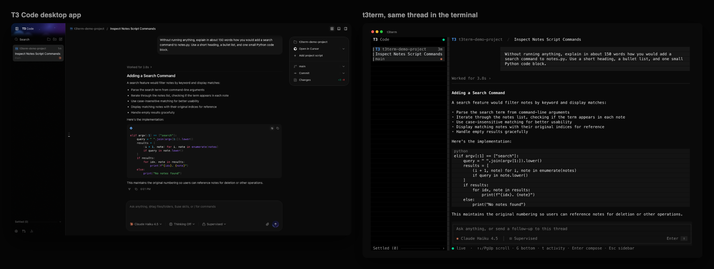
</p>

<p align="center"><sub>The same thread in both. The desktop app is on the left, t3term on the right.</sub></p>

## What you get

The TUI follows the desktop app closely, because muscle memory is worth more than a new idea here. The sidebar lists threads as cards with the project monogram, a status word or the thread's age, title, branch and provider glyph. The status words, their order and their colors are the desktop's. Approval and Input mean the agent waits on you, and they come first. Working has a spinner and a clock, and reads Goal while a `/goal` is active. Waiting means background work will wake the agent. Limited is a run that hit a usage limit and Failed is any other failure. Woke marks a snooze that ended, until someone dismisses it in the desktop app or the thread moves on. Done marks a finished run nobody has looked at since. A card with no word shows the time of its last message. The cards sit on the desktop's Pinned, Active, Snoozed and Settled shelves, in the desktop's order, each under its own heading. A Working shelf between Active and Snoozed is off unless you turn it on, as below. A snoozed thread comes back to its shelf when the snooze ends, and the Settled shelf stays closed until you open it. Forks are listed like any other thread. Archived threads and subagents are not. Your prompts are right-aligned bubbles. Approvals and questions open a panel above the composer with their keys printed on the buttons.

<p align="center">
  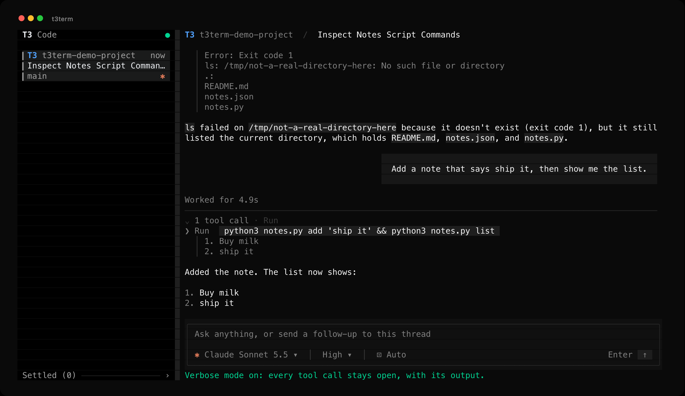
</p>

| Where | Keys |
| --- | --- |
| Anywhere | Tab / Shift+Tab move focus, Ctrl+B hide or show the sidebar, PgUp/PgDn scroll, Ctrl+X interrupt, Ctrl+C quit |
| Anywhere, approval pending | Alt+A accept, Alt+S accept for session, Alt+D decline. Alt+↑/↓ or the wheel scrolls a long request |
| Anywhere, thread open | Alt+M model, Alt+E reasoning effort and other model options, Alt+P access, and plan mode once it's turned on |
| Anywhere, tasks drawer showing | Alt+T open or close the task list. Alt+↑/↓ or the wheel scrolls a long list |
| Anywhere, error banner showing | Alt+W dismiss, Alt+I open or close the whole error. Alt+↑/↓ or the wheel scrolls an open error too long to show |
| Open menu | ↑/↓ choose, Enter select, Esc close. In the model menu, type to search |
| Sidebar | ↑/↓ or j/k select, Enter open, w open or close the Working shelf once it's turned on, e show or hide the Settled shelf, [ and ] narrow or widen the sidebar, 0 back to its usual width, q quit |
| Composer | Enter send (queues if the thread is busy), Alt+Enter or Ctrl+J newline, Ctrl+R swap in an unsent message, Esc to transcript |
| Transcript | ↑/↓ scroll, g/G top/bottom, t open or close every row of tool calls, p expand or collapse the first long plan in view, Enter compose, Esc, ← or h sidebar, showing it if hidden |

The wheel scrolls the transcript and the sidebar. Clicking ◧ at the top left of the conversation hides or shows the sidebar, and dragging the sidebar's right edge resizes it. Clicking a thread opens it, clicking the Working heading or the Settled footer opens or closes that shelf, clicking a chip under the composer opens its menu, clicking the top row of the tasks drawer opens or closes its list, clicking × on an error banner dismisses it, clicking elsewhere on a long error opens or closes it, and clicking a row of tool calls opens that row. Clicking the top edge of a long plan, or its Expand plan or Collapse plan button, expands or collapses that plan.

On macOS the Alt keys need Option to send Meta: "Use Option as Meta key" in Terminal, "Esc+" for the Option key in iTerm2, or `macos-option-as-alt = true` in Ghostty.

### Picking a model

A menu choice turns its chip blue and goes to T3 with the thread's next message, as in the desktop app.

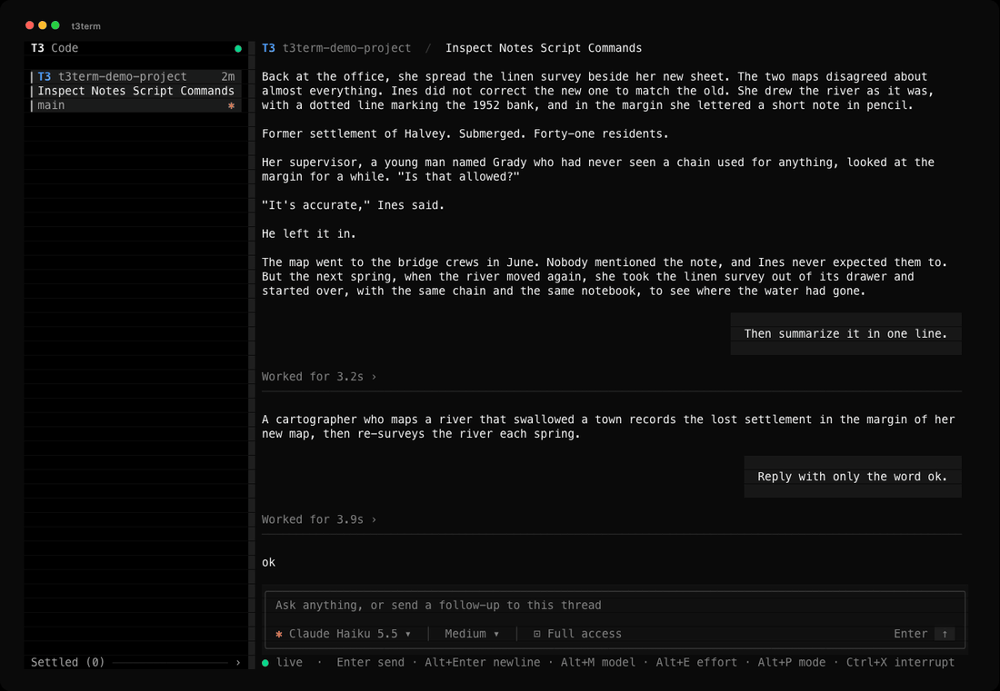

Ultrathink applies to that one message and comes back only if that message fails to send. T3 refuses a mode change while a run is active, so the TUI leaves the message in the composer to send once the run ends. That includes the switch back to Build below. A message that fails after you have typed something else or opened another thread is kept: the status line says so, Ctrl+R swaps it with the composer's text, and opening its thread with an empty composer brings it back. A send that times out can still reach T3, so if the thread later shows it, the TUI drops its kept copy rather than send it twice.

### Plan mode

Build and Plan are hidden by default, as in the nightly desktop app, which moved them behind a legacy setting. To bring them back, add `"planModeEnabled": true` to `~/.config/t3term/settings.json` and restart t3term. The desktop's "Plan mode (legacy)" switch uses the same key, though each app keeps its own copy. The Alt+P menu then has a Plan mode section, and a Plan chip shows while a thread plans. Providers without plan mode, such as Pi and Grok, never show either.

While Plan is hidden, the TUI sends every message in Build. A thread that the CLI, the desktop or an earlier t3term left in Plan goes back to Build with its next message from the TUI, as it would in the desktop. A model's Plan agent, such as OpenCode's, is hidden the same way. Alt+E leaves it out, and a thread saved on it sends its next message with the agent Alt+E shows, or with no agent when Plan was the only one. The setting changes nothing in the CLI, where `--plan`, `--no-plan` and `--option agent=plan` work either way.

### Proposed plans

A plan an agent proposes appears in the transcript as a card, like the nightly desktop's plan card. Its top edge has a Plan chip and the plan's title, which is the first Markdown heading in it, or "Proposed plan" when it has none. Inside is the plan as Markdown, without its title line or a Summary heading right under it. Cards show whether or not `planModeEnabled` is on. The checklist an agent keeps while it works is a different item. It stays a plain Plan row in the transcript, and the running turn's checklist also shows in the tasks drawer below.

A plan longer than 900 characters or 20 lines starts collapsed, as on the desktop. Characters here are UTF-16 code units, the desktop's measure, so an emoji counts as two. A collapsed plan shows its first ten lines with text, then `...`, and has an Expand plan button in its bottom edge. A click on the button or on the card's top edge expands it, and Collapse plan folds it again. With the transcript focused, `p` does the same for the first long plan in view, reading down from the top of the screen. A plan counts as in view while any of it shows, even after its top edge has scrolled off. With no long plan in view `p` does nothing, and the status line offers `p` only when it would act. A shorter plan shows in full and has no button.

Expanding or collapsing a plan keeps its top edge on the same screen row, so the text above it stays where it was. A collapse whose top edge had scrolled above the screen brings that edge back into view instead, as near the top row as the thread allows, so the shorter card doesn't end up out of view. Either way the view never scrolls past the end of the thread. When the card and what follows it are too short to reach the bottom of the screen from that row, the view stops at the end of the thread and the top edge sits lower. Expanding a plan near the bottom of the thread scrolls the view off the bottom, so new output stops pulling it down until you press G. A scroll that arrives before the screen redraws, such as G pressed right after p, wins, and the top edge moves with it. Each plan expands on its own. t3term remembers which are expanded only until you open another thread, and sends nothing to T3 or the settings file. The CLI prints plans as it did before.

The frame needs 17 columns, the width of the Collapse plan button and its two corners. A narrower card drops it. The Plan chip and as much of the title as fits take the top row, the plan follows at the full width, and a long plan ends with its button, cut short when the label doesn't fit. A click on either of those rows works as it does on the edges. Text too long for a row breaks onto the next one, mid-word if it has to, so none of the plan is cut off.

### Tasks

While a turn runs, the checklist its agent keeps shows in a drawer on the composer's top edge, as in the nightly desktop. Its top row names the step in progress, or the next one to do, or the last step once all are done. The row ends with the number of steps done, such as 2/5, which turns green when every step is done. In a drawer 60 columns or wider, a list of 2 to 10 steps adds a bar with a segment per step, colored by its state. Alt+T or a click on the top row opens the list under it. Each step has a mark, ✓ done, ◉ running or ○ to do, then its text and, on the right, a time. A finished step shows how long it took as T3 recorded it, and the running step shows `now`.

Alt+T is the drawer's only while the drawer shows. With no drawer, the key goes where it went before. Terminals send Esc then a quick `t` as Alt+T, so in the transcript that sequence still opens or closes every row of tool calls. While a drawer shows, the same Esc and `t` open its list instead, and a plain `t` still works.

The drawer shows the newest list written by the run that owns the thread's work, while that run hasn't ended. A new turn that hasn't written a list yet shows nothing, rather than the last turn's list. A queued message doesn't take the drawer from the run still working, and a list with no steps shows nothing. The drawer goes away when the run ends, while a request waits for an answer, and while the thread's watch connects or reconnects. When it comes back, its list starts closed, however briefly it was gone, as it does when you open another thread. Whether the list is open stays in this window, and t3term sends nothing to T3 or the settings file.

The open list takes at most 15 rows, the desktop's height, and at most 40% of the terminal. A longer list ends with a row such as `Lines 1-14 of 30 · Alt+↑/↓ scroll`, and Alt+↑/↓ or the wheel scroll it. With less room the list shrinks, and with none the drawer isn't drawn. The Alt+T label leaves a drawer under 40 columns, and a very narrow one shows only the count and the arrow. A long step breaks onto more rows, mid-word if it has to. CJK characters and emoji count two columns each, and an accented letter or an emoji such as 👩‍💻 or ⚠️ stays on one row.

In the transcript and in `t3term read`, a checklist shows as Plan rows marked `[x]` done, `[>]` running and `[ ]` to do.

An agent writes each step's text, so the drawer, the transcript and `t3term read` drop its control characters, such as Esc and the C1 codes, and a step can't move the cursor, clear the screen or set the clipboard. What followed an Esc stays as plain text. A carriage return starts a new row, and a tab or another blank control shows as a space. `t3term --json read` keeps the text as T3 sent it and writes each control character as a JSON escape, such as `\u001b` for Esc or `\u009b` for the C1 CSI. A terminal shows the escape as text, and a JSON parser reads back the original step.

### Thread errors

When a thread has an error, a banner at the top of the conversation shows it, as the nightly desktop's does. The banner lies over the transcript's first rows rather than pushing them down, so the text you are reading stays where it is. Its border is red, or amber for a usage limit. It is as wide as its text, up to 96 columns, and leaves a column of the conversation on each side.

| A provider session's error | A long error, open and scrolled to the end |
|---|---|
|  |  |

The threads are invented and come from a fake T3 server. The images render t3term's captured terminal output in truecolor. [Thread error verification](docs/thread-error-verification.md) lists what was checked, with captures of a usage limit in 256 colors and of a 30x10 screen. A [screen tour](docs/screenshots/thread-error-screen-tour.mp4) shows a long error closed, open and dismissed. It is a slideshow of the captures, not a recording.

The TUI picks the error as the desktop does. A send from this window that failed comes first, until the next send to that thread starts or the thread shows the message after all. Otherwise it is the error T3 holds for the thread: the last error of the thread's provider session, else the failure of the thread's latest run. A run's failure counts only when the run failed on its root node, so a failed tool call, a subagent's error, an older run's error and an error a fork inherited from its parent never show. A newer run replaces a failure as soon as it is queued, unless the queue is held. A usage limit is the exception: it stays the thread's error while newer messages wait behind it, until one of them starts. The banner is amber only when it shows the usage limit itself, so a different error from the provider session shows in red.

A send error belongs to the thread it went to. If it comes back after you have opened another thread, the banner waits for that thread, and the message is kept as before.

Alt+W or a click on × dismisses the banner. t3term remembers the dismissal until it quits, for that thread and that exact text, and sends nothing to T3 or the settings file. The error stays dismissed when you leave the thread and come back, the same text on another thread still shows, and a different error on the same thread shows again. Dismissing a send error shows the thread's own error if it has one.

A closed banner shows at most three rows of the error and at most half of the transcript, and its last row ends with `…` when there is more. Alt+I or a click on the banner opens the whole error, up to the transcript's height, and Alt+I or another click closes it. An open error too long for its rows shows a count such as `Lines 1-12 of 40`, and Alt+↑/↓ or the wheel scroll it. The banner's bottom edge names the keys that apply, as many as fit. A banner with fewer than 12 columns, or fewer than three rows it may take, has no border and shows only the text and ×. The wheel over a closed banner scrolls the transcript under it, and a click on the banner never reaches the row under it.

Alt+W and Alt+I are the banner's only while it shows. Terminals send Esc then a quick `w` or `i` as Alt+W or Alt+I, so while a banner shows, that sequence acts on the banner. Without one it does what it did before, and a plain `w` or `i` always does. Alt+↑/↓ go to an open error too long to show before a request panel or the task list. While a menu is open the banner's keys still work, and the first click closes the menu.

An error comes from a provider or a server, so the banner drops its control characters as the drawer does a step's. It prints at most the first 4,096 bytes of the error, cut where a character starts, and its last line says when it cut the rest. An error with nothing left to print, such as only spaces, shows no banner. Dismissal goes by the whole error, so an error that differs from a dismissed one only past those 4,096 bytes still shows.

A provider session's error can be any length, so the TUI reads it only after something that can change it. That is when you open the thread, when T3 sends a change to a run, a provider session, the thread or an error item, when T3 sends a fresh copy of the thread after a reconnect, when a send error comes or goes, and when you dismiss an error. A change from T3 copies the error out of the thread once. The banner then compares the whole error with the one it has. Only a new error is checked against the ones you dismissed and cleaned for printing, and the cleaning reads at most 4,096 bytes of it. A streamed answer, a redraw, and opening or scrolling the banner don't read the error at all.

The banner shows the thread's error only. The desktop's notices about a provider that is missing, out of date or signed out aren't in t3term yet. A few things differ from the desktop. t3term shows a failed send's error as the client reported it, where the desktop sanitizes it first. A usage limit always shows in the banner, because t3term has no notice of its own for the latest run. A check that fails before a message goes out, and a failed interrupt or answer, still show only on the status line. The desktop also keeps a thread's error while a pull request watch holds the thread, and t3term doesn't.

### Context compaction

When an agent compacts its context, the transcript and `t3term read` show a marker for it, with or without a title from T3. The marker names the compaction's state: Compacting context while it is pending, running or waiting, Context compaction failed, Context compaction stopped once it was cancelled or interrupted, and Context compacted otherwise. The nightly desktop's timeline calls a failed or pending compaction compacted, where t3term names its state.

A compaction that finished with both token counts shows them in the marker, such as `Context compacted 899K → 19K tokens`. Otherwise the counts T3 sent go on the line under it, with `?` for one it didn't send, such as `899K → ? tokens`. t3term writes counts as the desktop does, so 1,500 tokens reads `1.50K`.

The provider's summary comes next, which the desktop's timeline leaves out. t3term shows up to twelve lines with text from its first 4,096 bytes, and a last line of `…` when there was more. It drops the summary's control characters as it does a checklist step's, and `t3term --json read` keeps the summary as T3 sent it. In the TUI the marker is a rule across the transcript with the label in the middle, blue while the compaction is under way, and the summary wraps under it in grey. When T3 updates the item, such as when a running compaction finishes, the same marker changes in place. The TUI cleans the summary and writes the counts once each time T3 changes the item, not on every redraw.

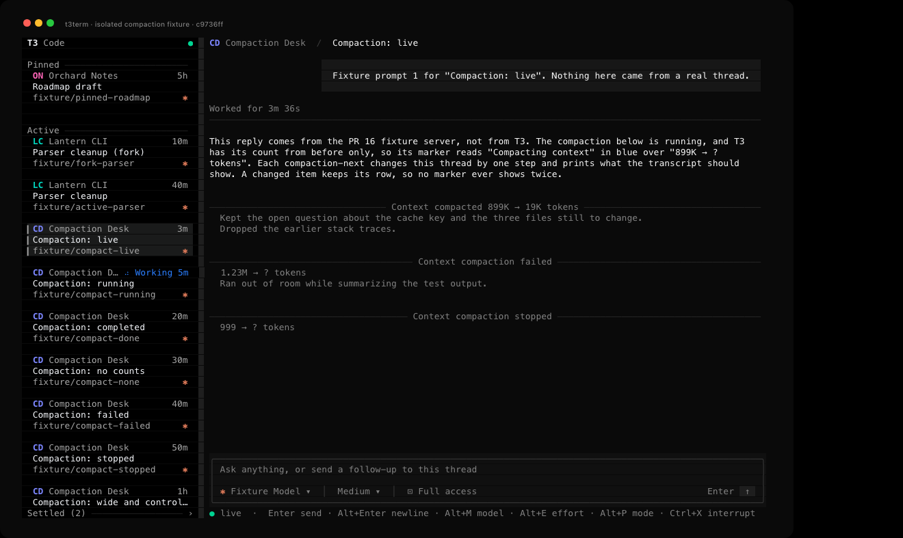

### Context handoff

When T3 hands a thread's context from one provider to another, the transcript and `t3term read` show a Context handoff marker, with or without a title from T3. The line under it lists the source models, then an arrow and the target model, such as `gpt-5.5, gpt-5.4 → claude-fable-5`. Sources keep T3's order, and past twelve a count such as `+3 more` stands for the rest. `t3term send --wait` and `t3term wait` print the marker and that line on stderr once, when a handoff in the turn they wait on has finished or failed.

Newer T3 servers stamp the models on the handoff. For an older handoff, t3term reads them from the thread's runs as the nightly desktop does. The target's model is that of the handoff's run, and each source's is that of the latest earlier run on its provider. An end with no known model shows its provider id, such as `codex_personal`. So does each end of a handoff that a fork inherited, because the fork doesn't have its parent's runs. The desktop shows names from T3's model and provider list, which `t3term read` doesn't fetch, so t3term shows the ids T3 sent.

Each end shows at most 64 columns and ends with `…` when cut. t3term drops its control characters as it does a checklist step's, and `t3term --json read` keeps the item as T3 sent it. In the TUI the marker is a rule like a compaction's, with the endpoints wrapped under it in grey and the label in red when the handoff failed. `t3term read` prints no colors, so a failed handoff reads the same there. The TUI works out the endpoints again when T3 changes the item and, for an older handoff, when a run is added or its model, provider or order changes, not on every redraw. A handoff stamped at both ends never reads the runs, and while no handoff in the transcript reads them, a run event doesn't make the TUI look the run up.

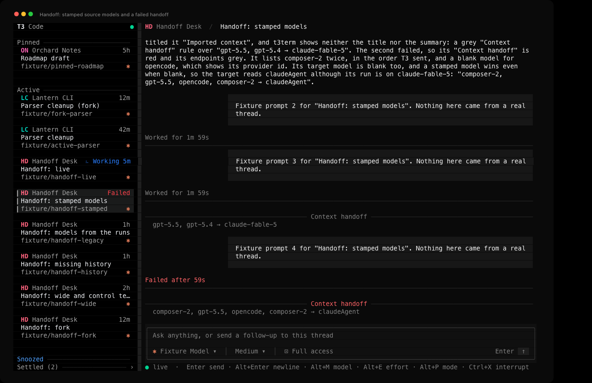

The thread is invented and comes from a fake T3 server. The image renders t3term's captured terminal output.

### The Working shelf

The nightly desktop app has a "Working shelf" setting, off by default, that moves threads busy without you out of Active. To turn it on in t3term, add `"sidebarWorkingShelfEnabled": true` to `~/.config/t3term/settings.json` and restart t3term. The desktop's switch uses the same key, though each app keeps its own copy. With it off, the sidebar is as described above.

With it on, a thread on the Active shelf moves to Working while a run is under way, or while background work will wake the agent, as long as nothing waits on you. An approval, a question, a failure or a plan waiting for your reply keeps it in Active. Pinned, snoozed and settled threads stay on their own shelves while they work. Working sits between Active and Snoozed and lists the thread you last sent a message to first, so a run finishing or waking again doesn't move a card. Active then lists the thread that most recently came back to you first. That is the latest of when it was created or reopened, when its latest run was requested or finished, and when it left Working, such as for an approval partway through a run. No server field records when a thread left Working, so t3term notes the moment it sees it happen. It forgets those moments when it quits, and it notes none for threads that were already waiting when it started.

The shelf starts closed, with its heading counting the threads in it. The open thread's card stays under the heading while it works, so sending a message doesn't hide it. `w` in the sidebar, or a click on the heading, opens or closes the shelf. t3term saves that choice in the same file, under `sidebarWorkingShelfExpanded`.

### Hiding the sidebar

Ctrl+B hides the sidebar and gives its columns to the conversation. It works from any pane, with a menu open too, and never types into the composer. Ctrl+B again, or a click on ◧ at the top left of the conversation, brings it back. On the desktop, Mod+B and the panel button in the title bar do the same.

| Shown | Hidden |
|---|---|
| 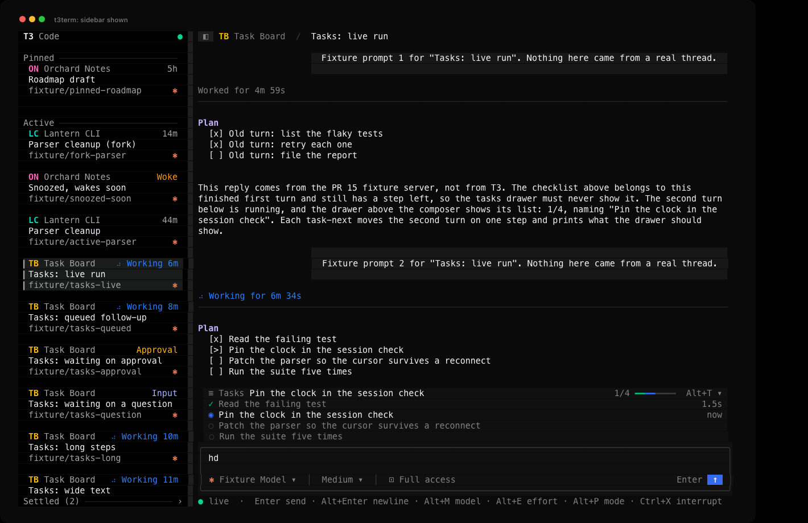 | 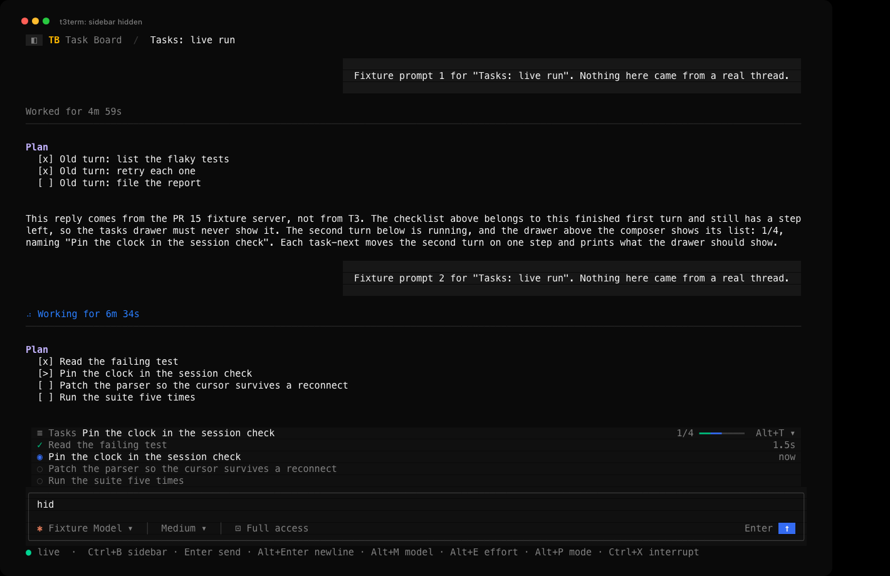 |

The threads are invented and come from a fake T3 server. The images render t3term's captured terminal output. A [screen tour](docs/screenshots/sidebar-screen-tour.mp4) shows these two and a hidden sidebar at 60x20 in 256 colors, for three seconds each. It is a slideshow of the captures, not a recording.

While the sidebar is hidden, the key hints on the status line start with `Ctrl+B sidebar`, and Tab and Shift+Tab move between the composer and the transcript. Esc, ← or h in the transcript show the sidebar and focus it. Hiding it while it has focus moves focus to the transcript when a thread is open, or else to the composer. The open thread, the draft and its cursor, and how far you have scrolled stay as they were. The sidebar keeps up with T3 while hidden, so it comes back with any new or renamed threads and with your highlight where you left it.

t3term saves the choice in `~/.config/t3term/settings.json` under `sidebarHidden`, so the next run starts the same way. A file without the key shows the sidebar. The desktop writes its choice to a cookie that it never reads back, so it opens with the sidebar shown every time, and this key is t3term's.

tmux uses Ctrl+B as its prefix. Inside tmux, press Ctrl+B twice to send one to t3term, or click ◧.

### Resizing the sidebar

Drag the sidebar's right edge, the one-column strip between it and the conversation, with the left mouse button. Or, with the sidebar focused, press `[` to narrow it and `]` to widen it by two columns. `0` puts back the width t3term picks, a quarter of the screen from 26 to 34 columns. On a screen at least 40 columns wide, the sidebar can be from 20 columns wide up to half the screen. A screen from 20 to 39 columns wide keeps 20 columns for the conversation and gives the sidebar the rest. Under 20 columns, the sidebar gets none and the conversation takes the whole screen. On the desktop you drag the edge of the sidebar and double-click it to reset. t3term has no double-click there, so `0` does the reset.

The edge follows the pointer while the button is down, and t3term saves the width when you let go. A click on the edge, or a drag that ends where it started, saves nothing, so the width still follows the screen. A key, Ctrl+B or a terminal resize during a drag puts the edge back where it was, and Esc does nothing else. With a menu open, the first press on the edge only closes the menu. A drag needs a terminal that reports the mouse moving while a button is held. Where it doesn't, `[` and `]` still work.

t3term saves the width in columns in `~/.config/t3term/settings.json` under `sidebarWidth`. A file without the key gives the width t3term picks. A screen too narrow for the saved width draws the sidebar narrower and keeps the saved width for when the screen grows again. The desktop keeps its width in pixels in the browser's storage, so this key is t3term's.

| Width t3term picks, 140x44 | Dragged to 51 columns, 140x44 |
|---|---|
| 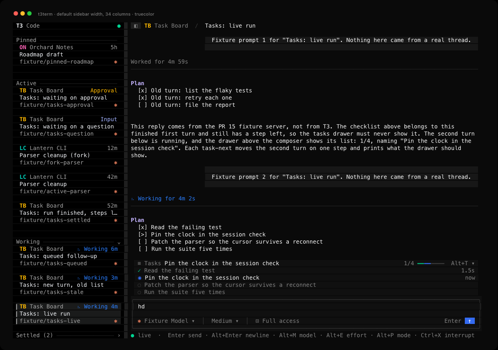 | 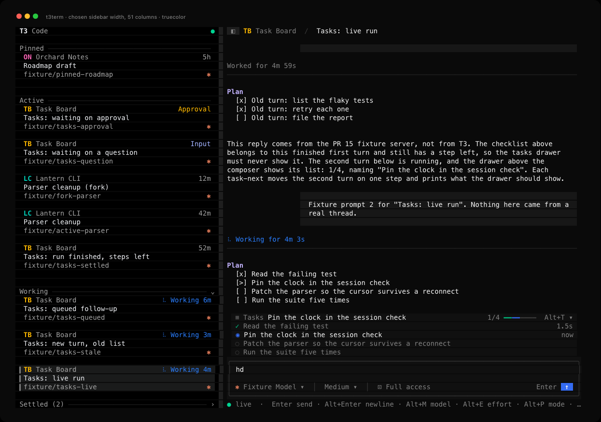 |
| **Saved 59, drawn at 40 on 80x24** | **Saved 48, 140x44 in 256 colors** |
| 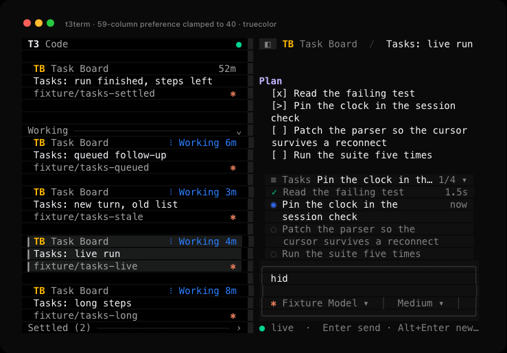 | ![A 48-column sidebar in 256 colors with Parser cleanup (fork) open and keep []0 draft unsent typed in the composer](docs/screenshots/sidebar-width-256.png) |

The threads are invented and come from a fake T3 server. The images render t3term's captured terminal output, the first three in truecolor. A [screen tour](docs/screenshots/sidebar-width-screen-tour.mp4) shows the four in this order for three seconds each. It is a slideshow of the captures, not a recording, so it shows neither the pointer nor the edge moving.

### Tool calls and reasoning

Reasoning is always there to read, laid out as prose in grey so the model's own answers stay the brightest text on screen. Tool calls are not: a run of them folds into one row saying how many there were and which tools ran, which keeps a turn short without hiding what it did.

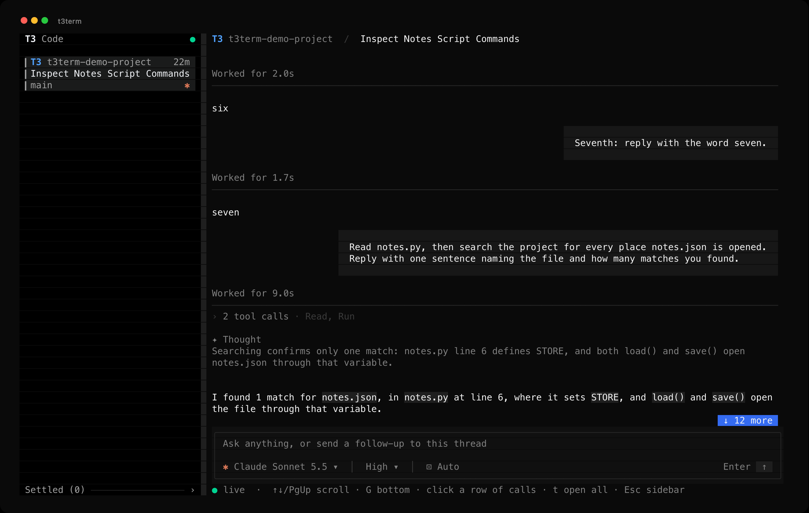

Click the row to open it. Each call is then one row with its icon, what it did and a chip holding the file, command or query it did it to, with the output quoted under it. A call that failed is red, and carries `exit N` when T3 reports the code. Clicking the row again closes it, and what you are reading stays where it is on screen while the rows above it grow.

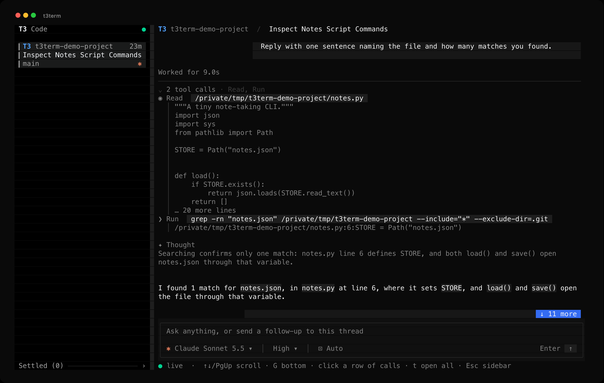

`t` opens every row at once and keeps new turns open, so a long run reads as it happens with no clicking. `t` again closes them all. The setting is saved in `~/.config/t3term/settings.json`, so it survives a restart. That file is t3term's own, not T3's. Each save reads the file again while it holds a lock on `settings.json.lock` beside it, then replaces the file whole, so a second t3term or a quick second `t` can't save over a change it hasn't read. If the file doesn't parse, t3term starts with the defaults and leaves the file as it is, so `t` saves nothing until you fix or delete it.

T3 leaves tool output out of a thread's projection so a large result can't stall the socket, and marks the item instead. t3term asks for it with `orchestration.getTurnItem`, only for the rows on screen, and keeps the answer until the item changes. Each row shows twelve lines: the first twelve of a file or a search, the last twelve of a command, where its result is.

Colors come from T3's dark theme. When `COLORTERM` reports truecolor the TUI uses the exact values. Otherwise, or when `T3TERM_COLOR=256` is set, it maps each one to the nearest entry in the 256-color palette.

### File changes

An edit's row reads `✎ Edit` with a chip holding the file and T3's line counts, such as `src/main.rs  +3 -1`. When T3 lists more than one operation in the edit, the chip counts the files instead, such as `2 files  +4 -2`, as the nightly desktop's `Changed 3 files` does. T3 counts lines for the whole edit and sends no count per file, so t3term never puts a count beside one path.

Open the edit's group and each operation T3 listed gets a line under the row. A move shows the old path and an arrow, and a file or MIME type follows in brackets when T3 sends one, such as `move /workspace/old.ts → /workspace/new.ts (text)`. The row lists at most twelve operations, and a line such as `… 988 more files` counts the rest. An entry without a path is left out and counted with the rest. When T3 sends no list, an empty one or one with no entry t3term can read, the row shows the file name alone.

When an edit fails, T3 sends the provider's error where a patch would be. The error comes first under the row, in red, and the operations follow, the order the desktop's item inspector uses.

The pinned nightly sends no patch for an edit that didn't fail, because the desktop reads full diffs another way. When a server does send one, t3term shows its start under the operations: hunk headers in blue, added lines in green, removed lines in red, file headers in bold grey and other lines in grey. The counts in each hunk's header say where the hunk ends, so a removed line that starts with `--` stays a removed line, and a text that isn't a patch reads as plain grey text. t3term never builds a patch of its own from the item's other fields.

An error or a patch shows at most twelve lines from its first 4,096 bytes, and a last line says what it left out, such as `… 18 more lines` or `… the text goes on past 4096 bytes`. t3term reads at most 1,024 bytes of a path, an operation or a file type, and ends one it cut with `…`. A line too long for the transcript ends in `…` at its edge, and a wide character or joined emoji that doesn't fit before it is left out whole. t3term drops the control characters of all of it as it does a checklist step's, and a tab shows as one space.

T3 sends the whole edit again each time it changes, such as when a running edit fails. The TUI describes the edit once for each change and draws it again in place, so a reader scrolled up stays on the same text. `t3term read`, `t3term send --wait` and `t3term wait` print the row alone, such as `edit src/main.rs  +3 -1`, with the file name cleaned the same way. `t3term --json read` keeps the item as T3 sent it.

There is no turn diff yet, and nothing opens an edit's full diff. Paths show as T3 sent them, not relative to the workspace, and the TUI doesn't show `oldStr` or `newStr`.

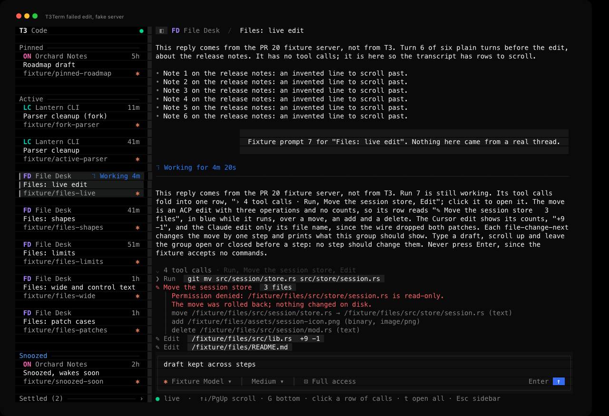

The thread is invented and comes from a fake T3 server that sends what the pinned nightly sends. The image renders t3term's captured terminal output. [File change verification](docs/file-change-verification.md) lists what was checked, with captures of the bounds, 256 colors, a narrow screen and a patch that only the fake server sends. A [screen tour](docs/screenshots/file-change-screen-tour.mp4) shows the live edit's captures in order. It is a slideshow of the captures, not a recording.

## It's a CLI too

```text
t3term doctor                       check discovery, protocol, auth and the WebSocket
t3term projects
t3term threads [--project P] [--all] [--limit N]
t3term read <thread> [--last N] [--reasoning]
t3term watch <thread>               live events; --json prints one item per line
t3term send <thread> [prompt] [--wait] [--timeout S] [--if-busy refuse|queue|steer] [choices]
t3term wait <thread>                stream the current turn until it ends
t3term requests <thread>            pending approvals and questions
t3term approve <thread> [--request ID] [--decision accept|accept-for-session|decline|cancel]
t3term interrupt <thread>
t3term models [--all]               providers, models and each model's options
t3term settings <thread> [choices]  show a thread's model and modes, or change them
t3term logout                       revoke the saved login and remove it from the Keychain
```

`<thread>` takes a full id, the 8-character prefix `threads` prints, or an exact title. `send` reads stdin when you leave the prompt out. Add `--json` to any command for machine-readable output. Inside its strings, every control character, DEL and the C1 codes included, is a JSON escape such as `\n` or `\u009b`.

Exit codes: 0 success, 1 failure or a turn that ended without completing, 2 usage, 3 not found, 4 rejected or unsupported protocol, 5 server unavailable, 6 timeout, 7 the turn is waiting for an approval or answer.

<details>
<summary><strong>Choosing a model, effort and mode from the command line</strong></summary>

The choices on `send` and `settings` are `--model`, `--effort`, `--option ID=VALUE`, `--mode` and `--plan` or `--no-plan`. Anything you leave out keeps the thread's current value.

- `--model` takes `provider/model` (for example `claudeAgent/claude-opus-5-5`), a model id, or a model name. A model id that two providers share needs the `provider/` part.
- `--effort` sets whichever reasoning option the model has: `effort` on Claude, `reasoningEffort` on Codex and Grok, `reasoning` on Cursor. `--effort ultrathink` adds `Ultrathink:` to the start of the message, as the desktop app does, and leaves the thread's effort alone.
- `--option` sets any other option the model lists, such as `fastMode=on` or `contextWindow=1m`.
- `--mode` is `approval-required` (also `supervised`), `auto-accept-edits`, `auto` or `full-access`.

`t3term models` lists the values each model accepts and marks defaults with `*`. t3term reads them from the server, so new models need no update here. Like the desktop app, `send` changes modes with their own commands just before the message and carries the model on the message itself, while `settings` applies the change right away. During an active run, `settings` refuses any change and `send` refuses a mode change, because T3 can restart the agent's session to apply them. `send` can still carry a new model on a queued or steered message.

</details>

## How it works

- **Discovery.** The client reads `~/.t3/userdata/server-runtime.json` (or `$T3CODE_HOME`, or `T3TERM_ORIGIN`). It checks `/.well-known/t3/environment` and refuses any server that is not on orchestration protocol 2.
- **Auth.** On macOS, t3term keeps one login per T3 server in the login Keychain under the service `t3term`. It lasts 30 days, the same as T3's own default, and holds only `orchestration:read` and `orchestration:operate`. Each run checks it against `/api/auth/session`, and if it expires within a day or the server rejects it, t3term issues a new one and revokes the old one, so you never log in by hand. `t3term logout` revokes and deletes it.
- **RPC.** Effect RPC over one `/ws` connection. The client acks every stream chunk and pings every 10 seconds. If no frame arrives for 30 seconds it treats the socket as dead.
- **State.** Each V2 event carries the whole updated entity, so the reducer upserts it by id. After a dropped connection the client resubscribes with `afterSequence` and skips any replayed event it already applied.
- **Rendering.** The TUI draws only after input or a server event, at most 30 times a second. The open thread keeps its transcript blocks between frames and describes an item again only after T3 changes it, so a frame drawn for a key or the clock describes nothing. Each block keeps its wrapped lines until it changes or the width does, and only the visible rows are copied into a frame. While the open thread has a run going or a card on screen reads Working or Goal, a once-a-second tick advances the spinners and clocks, and that tick stops when none does. While a thread is snoozed, one timer waits for the soonest snooze to end, because no server event marks that moment. The same redraw moves the card back and shows Woke. Otherwise an idle TUI wakes only for input or server events.

<details>
<summary><strong>More on the saved login</strong></summary>

`doctor --json` reports the session's `scopes` and where its `login` came from: `saved`, `newly saved` or `temporary`. With the saved login a CLI command uses under 20 ms of CPU, and the session check against the server takes about 27 ms. Issuing a new session costs about 0.8 s, because it runs `t3 auth session issue` through the running server's own binary. t3term finds that binary from the server pid, since the `t3` on your PATH can be a different version. Override it with `T3TERM_T3_COMMAND`.

Set `T3TERM_NO_SAVED_LOGIN=1` to use a session that lasts one run instead. t3term revokes it on exit, including after Ctrl+C, `kill` or a closed terminal window.

</details>

## Tests

```bash
cargo test
```

The unit tests cover the reducers, Markdown wrapping, the composer, the model menus, the transcript and the lines under a file change, the tasks drawer, the thread error banner, hiding and resizing the sidebar and auth command parsing. The TUI tests draw frames on ratatui's test backend with a client that never connects, and a test build keeps saved settings in memory, so no test writes `~/.config/t3term/settings.json`. `tests/fake_server.rs` drives the real RPC client against a fake Effect RPC server, dropping the socket mid-stream to check the resume cursor, chunk acks, batched frames, duplicate suppression and error decoding. `tests/cli.rs` runs the built binary with a temporary home and checks the `--json` error and exit code when the server is gone, when it isn't on protocol 2 and when the TUI has no terminal. It also runs `t3term read` against a fake server and a fake `t3` that issues a made-up session. It checks that the plain output drops the control characters of a checklist, a compaction summary and an edit's file name, and that `--json` writes them as escapes that decode to the text T3 sent. Each edit prints as one row, without its operations, error or patch. Another test runs `t3term send --wait` against a fake server that also plays T3's side of the WebSocket. It checks that each finished handoff in the turn prints its marker and endpoints on stderr once, even when T3 sends the item again, and that `--json` prints only the result. A test of `t3term wait` checks that each edit in the turn prints its row on stderr once, when it finishes, however often T3 sends it again. Three more check how a wait ends. `t3term wait` exits 7 with the outcome `needs-attention` when T3 asks for an approval, and 1 with the outcome `failed` when the run fails, with the reply so far on stdout. `t3term send --wait` exits 6 with `THREAD_WAIT_TIMEOUT` when the turn outlasts `--timeout`, and the error names the message it sent. None of them reach a real T3 server or the Keychain, and CI runs them on macOS for every pull request.

`docs/screenshots/` also holds `before-tui.png`, `after-tui.png`, `approval.png`, `streaming.gif`, `picker-model.png` and `tool-calls-failed.png`.

## Not done yet

- Answering a question from the CLI. `requests` lists one and the TUI can answer it, but there is no `answer` subcommand yet, so a script that hits a question has to hand over to a person.
- Loading older history for long threads. The TUI opens a bounded recent window.
- New threads, diffs and checkpoints, worktrees, attachments, embedded terminals and queue management.
- A check of the reducer's output against T3's TypeScript reducer on recorded event streams.
- Linux and Windows. The code has Linux pid lookup, but only macOS has been tested, and the saved login needs the macOS Keychain, so other systems would issue a new session every run.
- Syntax highlighting in code blocks and the project and git panel.
- Provider status notices. The TUI shows a thread's error, but not the desktop's notices about a provider that is missing, out of date or signed out, or its provider setup.
- Acting on a proposed plan. The desktop's card menu copies a plan, downloads it as Markdown or saves it to the workspace, and its composer offers Implement and Implement in a new thread. t3term only shows the plan. Its collapsed card also ends at ten lines with text and `...`, where the desktop clips the preview to a fixed height and fades it out.
- Pinning, snoozing, settling and reordering threads. The sidebar shows the shelves, but moving a thread between them still takes the desktop app. The Snoozed shelf also stays open, where the desktop starts it closed. Snoozed and settled threads are full cards, where the desktop shows a one-line row with the wake or settle time.
- Marking threads seen. The sidebar reads Done and Woke against the visit time the server keeps for each thread, but t3term doesn't report a visit when you open one, so only the desktop or another client clears those words. A server too old to keep visit times gets no Done from t3term at all, because the desktop's fallback is a visit time saved in the browser.

## Credit

[T3 Code](https://github.com/pingdotgg/t3code) is by [T3 Tools Inc.](https://t3.codes) and is MIT licensed. t3term exists because they built something worth writing a second client for, and because they made the protocol readable.

t3term is an unofficial, independent project. It is not made by, endorsed by or affiliated with T3 Tools Inc. It copies none of their code: it is Rust that speaks their WebSocket API. The dark palette is read from T3 Code's MIT-licensed theme so the two look like the same product, and the screenshot above shows their desktop app for comparison. "T3" and "T3 Code" are theirs.

MIT, see [LICENSE](LICENSE).
