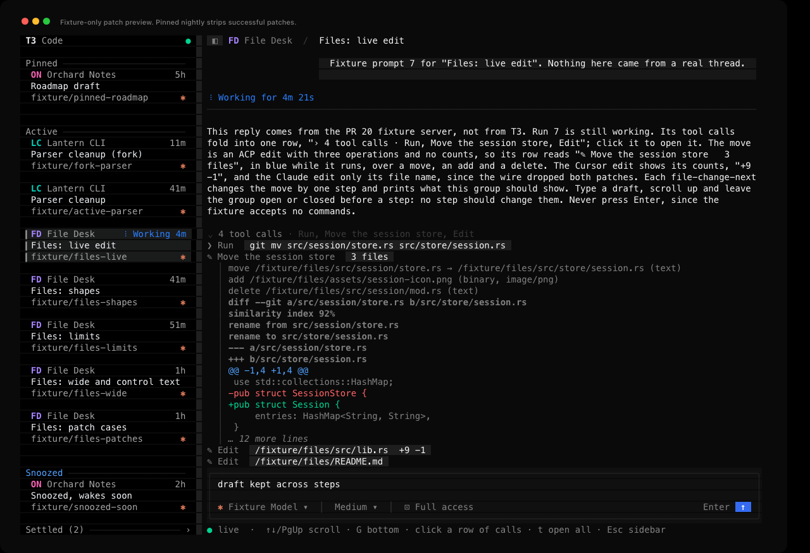
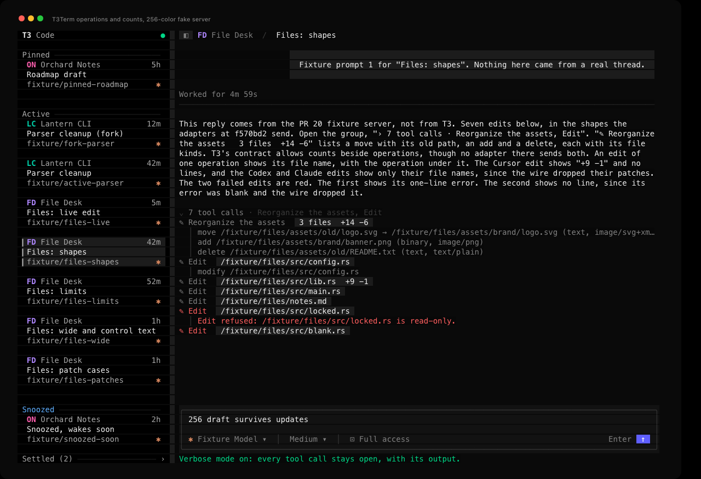
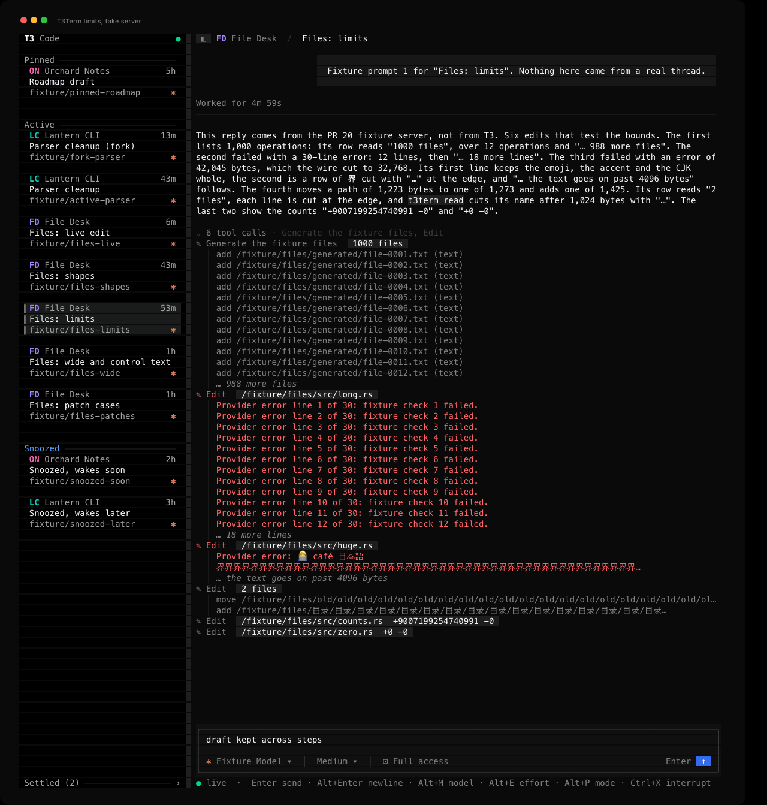

# File change verification

This page records how GPT-6.1 Sol checked the file change rows from [PR #20](https://github.com/krishhgg/t3term/pull/20) in the t3term binary, on 2026-10-09, at source `712aee24f8145fa9e37cde2fcb37f1d1db504697`. The README's [File changes](../README.md#file-changes) section describes the behavior. The pull request lists the unit tests, Clippy and the CI jobs. Nothing here measures speed, CPU or battery.

## What the pinned nightly sends

t3term follows T3 Code nightly `f570bd21663f56ce94c41829d3b7d72886e25a34` (v0.0.46-nightly.20261007.2787). Its `apps/server/src/orchestration-v2/WireProjection.ts:97-104` removes `diffStr`, `oldStr` and `newStr` from every file change it sends. It keeps `diffStr` only on a failed edit whose text isn't blank, and there the text is the provider's error. `orchestration.getTurnItem` goes through the same projection. Against this nightly, t3term shows each edit's operations and a failed edit's error, and never a patch.

The fake server stores each item as that projection would send it. The steps and cases below that put a patch on an edit that didn't fail are marked fixture-only. They show what t3term does when a server sends one, which the pinned nightly never does.

## How it ran

- The t3term binary built from `712aee2` ran twice, once in truecolor and once in 256 colors.
- A temporary Python script, kept outside the repository, served a fake T3 server on a random port on 127.0.0.1.
- Each run had its own temporary `HOME` and `T3CODE_HOME`, no Keychain entry, no saved login and a private tmux socket.
- The File Desk project and its five threads are invented, like the other projects in the sidebar. The fake server accepted no agent commands in either run.
- At the end of each run, all seven sessions the fake server issued were revoked and the TUI exited with status 0. The fake server and the tmux server stopped, and the temporary directories were deleted.

## The live edit, step by step

"Files: live edit" has six plain turns to scroll through, then a running turn whose four tool calls fold into `4 tool calls · Run, Move the session store, Edit`. The move is an edit with a move, an add and a delete and no counts, as the ACP adapter sends it. Each step sends that same item again, whole, with a later `updatedAt`, in a `turn-item.updated` event.

| Step | Source | What the TUI showed |
|---|---|---|
| Start | Wire-native | `✎ Move the session store   3 files` in blue over the three operations in grey |
| fails | Wire-native | The row in red over the two-line error in red, then the three operations |
| completes | Wire-native, patch dropped by the wire | The row in grey over the operations, with no error and no patch |
| patch-preview | Fixture-only | Twelve patch lines styled as file headers, a hunk header, context, a removal and an addition, then `… 12 more lines` |
| replay | Fixture-only, the last step's events again with their old sequence numbers | No change, and no line shown twice |
| reconnect | Fresh snapshot after the fixture dropped the sockets | The snapshot carries no patch, so the preview is gone. The group reads `5 tool calls`, with `✎ Edit   /fixture/files/src/store/mod.rs` last |
| run-ends | Wire-native | The turn reads `Worked for` instead of `Working for`, and the edit rows don't change |

In the 256-color run, Sol scrolled the transcript up and captured it before the first step and after each update. Every transcript line above the `↓ N more` counter stayed the same through fails, completes, patch-preview, replay and reconnect. The counter changed as rows below the view came and went: 34 before, 36 after the failure added two error lines, 34 after completion, 47 with the patch's twelve lines and note, 47 after the replay and 36 after the reconnect added the fifth edit and its operation. In the same run the group stayed folded while the run ended and opened afterwards.

In both runs the draft in the composer, the focus and verbose mode stayed as they were through every step. In the truecolor run, the replay left the edit's lines exactly as they were.

| Failed, wire-native | Patch preview, fixture-only |
|---|---|
|  |  |

The [screen tour](screenshots/file-change-screen-tour.mp4), about 22 seconds long, shows the live edit's captures in order: running, failed, completed, the fixture-only patch and the ended run. It is a slideshow of still captures, not a recording, so it doesn't show how long each step took.

## The other threads

"Files: shapes" holds seven edits in the shapes the adapters at the pin send, after the wire projection.

- The first edit has a move from an old path, an add and a delete, each with a file and MIME type, and counts. It reads `✎ Reorganize the assets   3 files  +14 -6` over three operation lines. The contract allows counts beside operations, though at the pin the ACP adapter sends operations without counts and only the Cursor adapter sends counts.
- An edit with one `modify` shows its file name, with the operation under it.
- A Cursor-shaped edit, with counts and no `changes`, shows `+9 -1` and no lines.
- Codex- and Claude-shaped edits, which carry no `changes`, show only their file names, since the wire dropped their patches.
- A failed edit shows its one-line error in red. A failed edit whose error was blank shows no line, because the wire dropped the blank text.
- The fixture-only `malformed` case adds an edit whose `changes` hold nothing t3term can read: an entry without a path, one with a blank path, a string and a number. It reads `✎ Edit   /fixture/files/src/malformed.rs  +5 -0` with no lines under it. The fixture never stores it, so the next snapshot drops it.

"Files: limits" tests the bounds.

- 1,000 operations give `1000 files`, twelve operation lines and `… 988 more files`.
- A 30-line error gives twelve lines and `… 18 more lines`.
- A 42,045-byte error, which the fixture cuts to 32,768 bytes as the wire projection does, keeps an emoji, an accent and CJK whole on its first line. Its second line, a row of `界`, ends in `…` at the edge, and `… the text goes on past 4096 bytes` follows.
- A move from a 1,223-byte path to a 1,273-byte one and an add of a 1,425-byte path read `2 files`, and each line ends in `…` at the edge.
- The counts `+9007199254740991 -0` and `+0 -0` show as sent.

"Files: wide and control text" mixes Unicode and control characters.

- Paths with a joined emoji, an accent and CJK show whole. A line too long for the transcript ends in `…` without splitting a character.
- One failed edit carries ESC, CSI, OSC, BEL, DEL, BS, CR, TAB, VT, FF and C1 codes in its file name, paths, operation, types and error. A second entry's path is made only of control codes, so t3term leaves it out and shows `… 1 more file`. t3term drops the control characters themselves. The printable rest of an escape sequence stays as text, so ESC `[31m` shows as `[31m`, as it does elsewhere in the transcript.
- A failed edit whose error is a single C1 next-line code shows no line under it.

"Files: patch cases" starts with six edits that show only their file names, as the wire sends them. Each of the six `file-change-case` commands sends one of them again with a patch. All six are fixture-only.

- `hunks`: file headers, a hunk whose removed line starts with `--- ` and added line with `+++ `, a blank context line and `\ No newline at end of file`. Inside the hunk, `--- old rule` is red and `+++ new rule` is green.
- `bogus`: after a hunk header without ranges, in blue, `+` and `-` lines stay green and red until a plain line ends the hunk. After an empty `@@ -0,0 +0,0 @@` hunk, and after the last line a `@@ -3 +3 @@` hunk counts, a `+` line is plain grey.
- `long`: two added lines of CJK, each cut with `…` at the edge, then `… the text goes on past 4096 bytes`.
- `controls`: CSI, OSC, BEL, DEL, TAB, VT, FF, C1 and a lone CR inside the patch. None reaches the terminal.
- `text`: a Claude-style result that isn't a patch. Its `-` and `+` lines outside any hunk are plain grey, and a line starting `--- ` is bold grey like a file header.
- `unicode`: an accent, a joined emoji and CJK in the paths and lines stay whole, and a line too long for the transcript ends in `…`.

The fixture never stores these patches either, so reopening the thread drops them.

## Control characters

The fixture planted control characters in names, paths, operations, types, errors and patches. It then searched all the bytes t3term wrote to its terminal, 205,924 in the truecolor run and 282,287 in the 256-color run, for 23 byte sequences, each a planted control character with the text around it, and for any C1 code. Every count was 0 in both runs. t3term's own escape codes for colors and cursor moves don't match those sequences, so the search tells them apart.

## Sizes and the sidebar

The truecolor run drew the File Desk threads at 140x44, 140x70, 80x24, 40x12, 24x8 and 10x5. The 256-color run also used 60x20, dragged the sidebar's edge at 80x24 and checked the width limit there, hid and showed the sidebar, and went back to 140x44. After shrinking to 10x5 and growing back, both runs showed the same thread, draft and view as before.

## The CLI

In each run, `t3term read` printed the rows the fixture expected for all five threads, and `t3term --json read` ran as well. In the truecolor run, the JSON kept a `fileName` full of control characters as T3 sent it, with each control character written as an escape such as `\u001b`, and the plain `read` printed the same name with no control characters. All twelve CLI commands across the two runs exited with status 0.

## Where the evidence is

The captures, logs, status reports and terminal recordings stay on the machine that ran the checks, in `/tmp/t3term-pr20-verification-712aee2`, and are not committed. The images in this page render t3term's captured terminal output, and the threads in them come from the fake server. They are not screenshots of t3term connected to a live T3 server.
