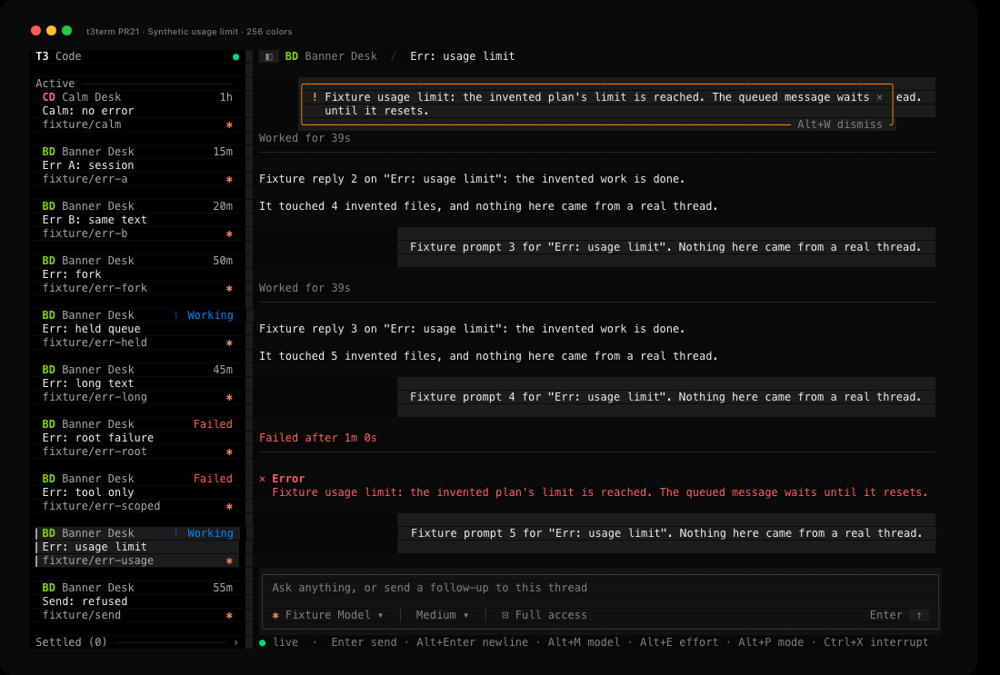
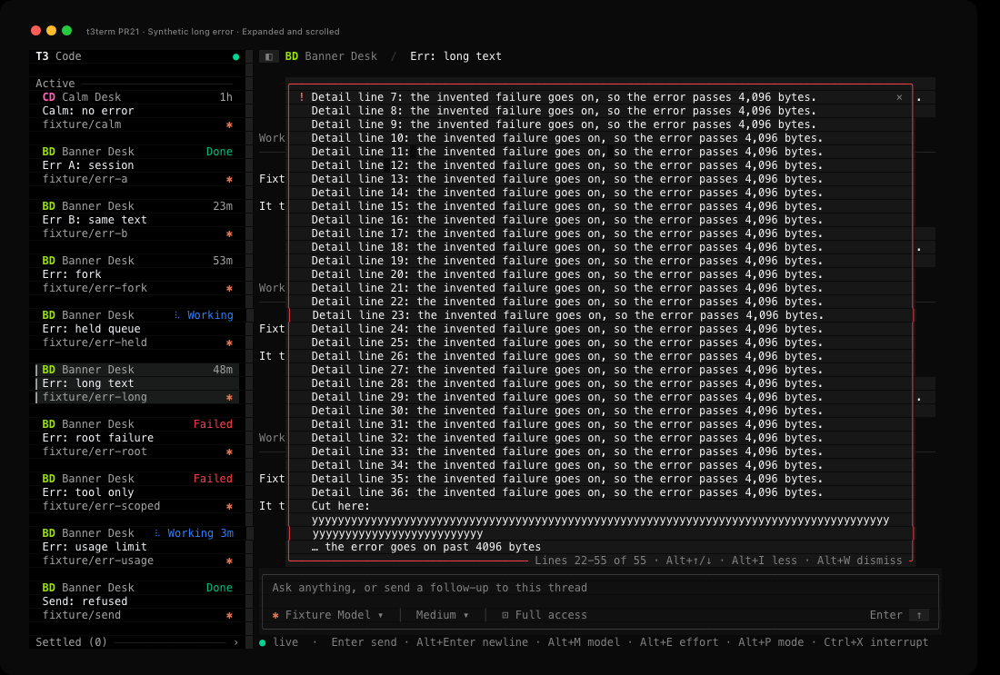
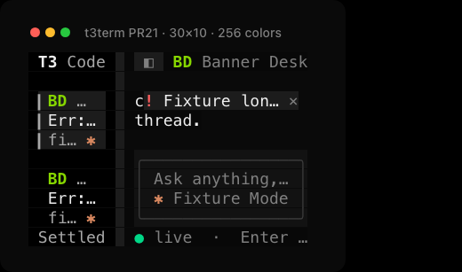

# Thread error verification

This page records how GPT-6.1 Sol checked the thread error banner from [PR #21](https://github.com/krishhgg/t3term/pull/21) in the t3term binary, on 2026-10-09, at source `8dbb958749e4c6edd0239bbf50157ba3103ae200`. The README's [Thread errors](../README.md#thread-errors) section describes the behavior. The pull request lists the unit tests, Clippy and the CI jobs. Nothing here measures speed, CPU or battery.

## How it ran

- The debug build of t3term from `8dbb958` ran three times at 140x44, twice in truecolor and once in 256 colors.
- A temporary Python script, kept outside the repository, served a fake T3 server on a random port on 127.0.0.1.
- Each run had its own temporary `HOME` and `T3CODE_HOME`, `T3TERM_NO_SAVED_LOGIN=1` so no Keychain entry, and a private tmux socket. t3term ran under `env -i`. A stand-in `t3` command issued and revoked sessions on the fake server only.
- The Banner Desk project, its nine threads, the Calm Desk thread and every error in them are invented.
- The fake server received five `message.dispatch` commands, all in the first truecolor run and all for the send cases below. It received no other command, so dismissing, opening and scrolling a banner sent nothing to T3.
- The fake server issued five sessions across the three runs and revoked all five. t3term started five times, once in each truecolor run and three times in the 256-color run, and exited with status 0 each time. The fake servers and the tmux servers stopped, and the temporary directories were deleted.

## Which error shows

| Thread or step | What the TUI showed |
|---|---|
| Err A: session, a provider session's `lastError` | A red banner over the transcript's top rows, with the transcript's text still showing on each side |
| Err B: same text, the same `lastError` on its own session | The same banner |
| Err: root failure. Its latest run failed on its root node and also has a failed tool call, a subagent's error and an earlier root report | Only the later root report. The transcript still lists the other errors |
| Err: tool only. A failed tool call and a subagent's error in the latest run, an older run's root failure, and a session error on another provider instance | No banner |
| Err: fork, whose inherited history shows its parent's root failure | No banner |
| Err: usage limit, with a newer run queued behind it | An amber banner, gone once the queued run started |
| Err: held queue, with a newer run in a held queue | A red banner, gone once a run that wasn't held was queued |
| `lastError` set to null, to an empty string, or to only spaces and control characters | No banner |
| A session attached with a new error, then detached | The new error showed, then the banner went away |
| Calm: no error | No banner |

The second truecolor run checked the held queue clearing and the empty `lastError`. The first checked the other rows, and the 256-color run checked Err A and the usage limit again. In truecolor the red border was RGB 251,65,74 and the amber one 254,154,0. In 256 colors they were palette entries 203 and 208.

| Session error, truecolor | Usage limit, 256 colors |
|---|---|
|  |  |

## Dismissing

- Alt+W on Err A hid its banner. The draft `draft stays here` stayed in the composer, and every transcript cell outside the banner's rectangle stayed the same.
- Err B still showed the same text. Back on Err A, the banner stayed hidden, and an update with the same text kept it hidden. A new text on Err A showed.
- In the 256-color run, back at 140x44 after the narrow sizes below, Alt+W dismissed the long error. Err A's error, dismissed before a restart, showed again after it, and a click on × then dismissed it. t3term restarted twice in that run.

The fixture never sent two errors that differ only past byte 4,096. The tests in the pull request cover that case.

## Send errors

These ran in the first truecolor run.

- A refused send on Send: refused showed `T3 rejected message.dispatch: …` in a red banner, with the same text on the status line. The refusal's reason held ESC and C1 sequences, and the banner showed only their printable rest, such as `[2J screen` and `]52;c;Zml4dHVyZQ==`. Alt+W dismissed it.
- A send the fixture refused after a delay came back while Calm: no error was open. Calm showed no banner, and the banner showed when Send: refused was opened again.
- Ctrl+R and a send the fixture accepted cleared the banner.
- A send the fixture refused and then let land about two seconds later cleared the banner when the message landed. The status line read `A message that failed reached T3 after all, so t3term took it out of the composer.`
- On Err A, a refused send showed in place of the session error. Alt+W on it showed the session error again.

## Updates from T3

- The fixture dropped the sockets and replayed Err A's events with a new error. Once t3term reconnected, the banner showed the new error. After a reconnect that sent a fresh snapshot with `lastError` null, the banner went away.
- While a 200-piece reply streamed on Err A, captures at the 32nd and the 187th piece show the session error's banner unchanged.
- In the second truecolor run, the long error stayed open at `Lines 1-34 of 55` while a 200-piece reply streamed under it. After Alt+W, another 200-piece reply streamed to the end of its run with the banner still hidden.

## Long errors

Err: long text has an error of about 5,200 bytes with CJK, emoji, a 300-column word and control characters, and a three-byte character across byte 4,096.

- Closed, the banner showed three rows, the third ending in `…`, and its bottom edge read `Alt+I more · Alt+W dismiss`.
- In the first truecolor run, a click on the banner opened it at `Lines 1-34 of 55`. The wheel scrolled it to `Lines 22-55 of 55`, whose last line reads `… the error goes on past 4096 bytes`, and Alt+I closed it. In the 256-color run, Alt+I opened it, Alt+↓ moved it to `Lines 2-35 of 55` and the wheel took it to `Lines 22-55 of 55`.
- The wheel over Err B's closed banner scrolled the transcript under it. 23 rows of the transcript changed, and the banner stayed.

| Long error, open and scrolled to the end | 30x10, 256 colors |
|---|---|
|  |  |

The [screen tour](screenshots/thread-error-screen-tour.mp4), about 9 seconds long, shows captures of the same long error closed, open and scrolled to the end, and dismissed. It is a slideshow of still captures, not a recording, so it doesn't show how long each step took.

## Keys, clicks and menus

- With the model menu open, Alt+W dismissed the long error and the menu stayed open.
- In the second truecolor run, with the menu open over Err B, a click on × closed the menu and left the banner.
- Esc and `w` in one terminal write dismissed Err B's banner with the transcript focused. With the banner gone, a click on the composer and a plain `w` typed `w`. Esc and `w` written 5 ms apart didn't act as Alt+W. This check doesn't find the gap at which Esc and `w` stop counting as Alt+W.

## Sizes and the sidebar

- Ctrl+B hid the sidebar, and the banner moved to the center of the wider transcript. At 30x10 with the sidebar hidden, the banner was one row of text and × with no border.
- In the 256-color run, at 30x10 with the sidebar shown and at 10x5, the banner was one row of cut text and ×, inside the transcript. The run went to both sizes twice and back to 140x44 each time.

## Control characters

The fixture planted ESC, OSC 52, C1 CSI, BEL, BS, TAB, CR and DEL in the long error, and escape sequences in a refusal's reason. In each run it searched every byte t3term wrote to its terminal for four of the planted sequences, each with the text after it: an OSC 52 clipboard write, a C1 CSI clear, a red color code and a clear-screen code. Every count was 0 in all three runs. The search covers those four sequences only, so it doesn't prove that no other control byte got through.

## Settings

Only the first truecolor run wrote a settings file, when Ctrl+B hid the sidebar. Its keys were `planModeEnabled`, `sidebarHidden`, `sidebarWorkingShelfEnabled`, `sidebarWorkingShelfExpanded` and `verbose`, which t3term already saves, and none came from the banner. The other two runs wrote no settings file.

## What this doesn't show

- Nothing here ran against a live T3 server or a real provider.
- The claim that a streamed answer doesn't read a long error again rests on the tests in the pull request, which count that work. Nothing here timed it.
- The README lists what the banner leaves out, such as the desktop's provider status notices and its cleaning of a failed send's error.

## Where the evidence is

The captures and status reports stay on the machine that ran the checks, in `/tmp/t3term-pr21-evidence-8dbb958`, and are not committed. The images in this page render t3term's captured terminal output, and the threads in them come from the fake server. They are not screenshots of t3term connected to a live T3 server.
